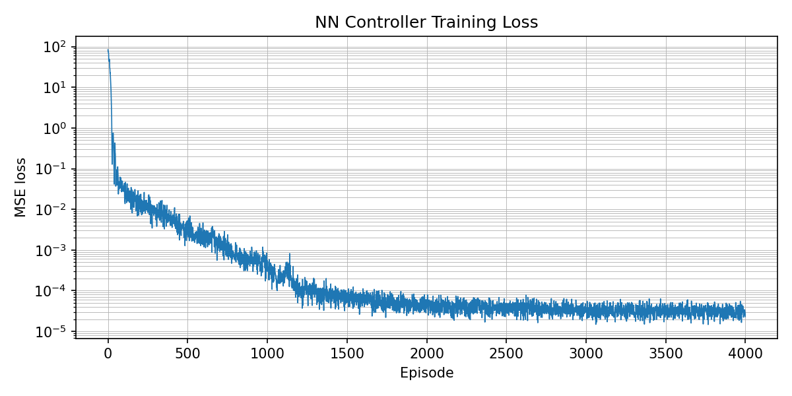
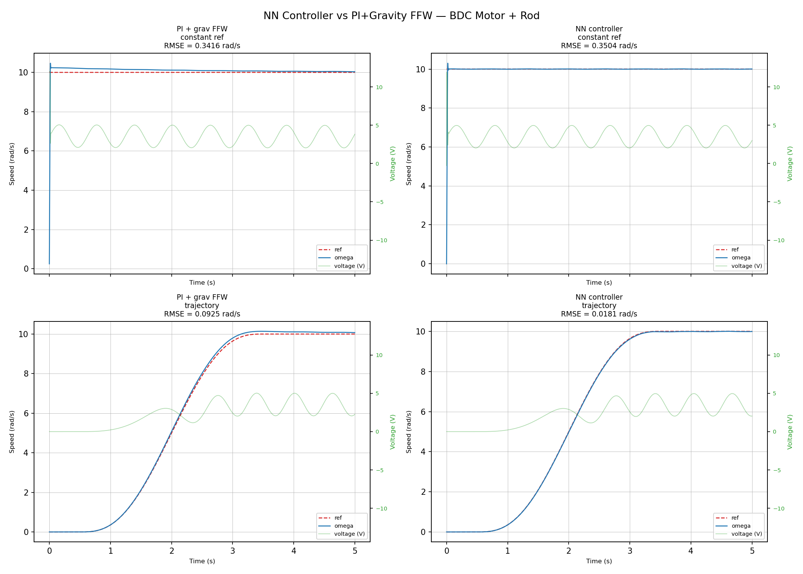
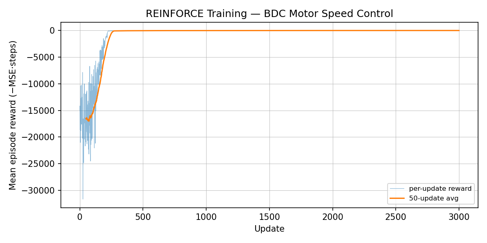
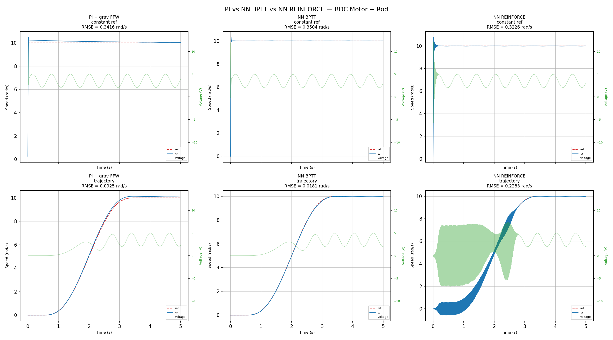

# Neural Network Speed Controllers for BDC Motor + Vertical Rod

**Author:** Phanpasorn Laor-iam  
**Course:** AI for Electrical Engineering 2026 — Xi'an Jiaotong University

---

## Overview

This work implements and compares two neural network approaches to replace the classical PI+feedforward speed controller for a brushed DC motor carrying a vertical rod load.

The rod creates a gravity disturbance torque `T_grav = m·g·(l/2)·sin(θ)` that oscillates as the motor spins — a challenging periodic disturbance that classical PI cannot fully reject.

**Two methods implemented:**

| Method | Folder |
|--------|--------|
| Model-Based (Backprop Through Time) | `control_neural_model_based/` |
| Reinforcement Learning (REINFORCE) | `control_reinforcement_learning/` |

Both share a differentiable motor simulation in `utils/motor_torch.py`.

---

## System Parameters

| Parameter | Symbol | Value |
|-----------|--------|-------|
| Armature resistance | R | 3.0 Ω |
| Armature inductance | L | 4×10⁻³ H |
| Torque constant | Kt | 0.05 N·m/A |
| Back-EMF constant | Kb | 0.05 V·s/rad |
| Rotor inertia | J | 7.4×10⁻⁵ kg·m² |
| Viscous friction | B | 0.005 N·m·s/rad |
| Max voltage | V_max | 12 V |
| Rod mass | m | 0.05 kg |
| Rod length | l | 0.1 m |

**Motor ODEs (state: [i, ω, θ]):**

```
L · di/dt  = V − R·i − Kb·ω
J · dω/dt  = Kt·i − B·ω − m·g·(l/2)·sin(θ)
    dθ/dt  = ω
```

---

## Method 1 — Model-Based BPTT (`control_neural_model_based/`)

### Concept

Rewrite the motor ODEs in PyTorch tensors. Gradients flow **through the simulation** back into the network weights. No recorded data required — the network learns by experiencing the simulated consequence of its own voltage commands.

```
NN weights → V → [motor physics in PyTorch] → ω → tracking error → backprop → NN weights
```

### Network Architecture

```
Input (6) → Linear(64) → Tanh → Linear(64) → Tanh → Linear(1) → tanh × V_max
```

**6 inputs (all normalized to ~[−1, 1]):**

| Input | Formula | Why |
|-------|---------|-----|
| Speed error | e / 15 | Proportional signal |
| Error change | Δe / 1 | Derivative signal — raw Δe, not Δe/dt (÷1e-3 amplifies 1000×) |
| Integral error | ∫e / 15 | Eliminates steady-state offset |
| Target speed | ω_ref / 15 | Different speeds need different feedforward V |
| Gravity (sin) | sin(θ) | Gravity torque direction, always ∈ [−1,1] |
| Gravity (cos) | cos(θ) | Disambiguates rod quadrant |

> **Why sin/cos instead of θ?** Raw θ grows unboundedly as motor spins — NN encounters out-of-distribution inputs. sin/cos always stays bounded.

> **Why tanh × V_max output?** Hard clamp kills gradients at ±V_max. tanh saturates smoothly so gradients remain nonzero everywhere.

### Training

- **Integration:** RK4 (Euler is unstable — electrical time constant τ = L/R = 1.33 ms ≈ dt)
- **Episodes:** 4000 × 64 parallel rollouts × 300 steps each
- **Truncated BPTT:** detach gradient every 50 steps (prevents gradient explosion over 300 steps)
- **Randomization:** ω_ref ~ Uniform(−15, 15) rad/s, θ₀ ~ Uniform(−π, π) per episode
- **Loss:** MSE on last 75% of episode (skip startup transient)
- **Optimizer:** Adam, LR = 1×10⁻³, cosine decay → 5×10⁻⁵

**Training curve:**



Loss converged from ~10² to ~2×10⁻⁵ (4 orders of magnitude) over 4000 episodes.

### Results



| Scenario | PI + grav FFW | NN BPTT |
|----------|---------------|---------|
| Constant ref (10 rad/s) | 0.3416 rad/s | 0.3504 rad/s |
| Trajectory (0→10 rad/s) | 0.0925 rad/s | **0.0181 rad/s** |

NN BPTT achieves **5× lower RMSE** on trajectory tracking vs PI + gravity feedforward.

---

## Method 2 — REINFORCE (`control_reinforcement_learning/`)

### Concept

Treat the simulation as a **black box**. Only the log-probability of the action needs gradients — the simulation never enters the computational graph.

```
Policy samples V ~ N(μ(s), σ) → black-box motor sim → reward r = −e² → policy gradient
```

This approach can be applied to **real hardware** without knowing the physics equations.

### Policy Network

Same 6-input MLP architecture as BPTT, but with a **learnable standard deviation** parameter:

```
π(V | s) = N(μ(s), σ)    where σ = exp(log_std),  log_std learnable
```

- **Training:** sample actions for exploration, use mean action at test time
- **Initial σ:** exp(0.5) ≈ 1.6 V — sufficient exploration range

### Training (REINFORCE with Baseline)

```
For each update:
  1. Collect 16 episodes with stochastic policy
  2. Compute discounted returns  G_t = Σ γᵏ r_{t+k}  (γ = 0.99)
  3. Normalize returns (variance reduction baseline)
  4. Loss = −E[ log π(a|s) · G_t ] − 0.01 · entropy
  5. Adam step (LR = 3×10⁻⁴)
```

- **Total:** 3000 updates × 16 episodes = 48,000 episodes
- **Entropy bonus (0.01):** prevents policy collapse to deterministic too early

**Training curve:**



Converged by ~500 updates. Rapid but noisy early exploration.

### Results



| Scenario | PI + grav FFW | NN BPTT | NN REINFORCE |
|----------|---------------|---------|--------------|
| Constant ref (10 rad/s) | 0.3416 | 0.3504 | **0.3226** |
| Trajectory (0→10 rad/s) | 0.0925 | **0.0181** | 0.2283 |

REINFORCE achieves lowest RMSE on constant ref but with **chattery voltage** (rapid switching). Fails to generalize to trajectory (never encountered time-varying reference during training).

---

## Full Comparison

| | PI + grav FFW | NN BPTT | NN REINFORCE |
|---|---|---|---|
| Constant ref RMSE | 0.3416 | 0.3504 | **0.3226** |
| Trajectory RMSE | 0.0925 | **0.0181** | 0.2283 |
| Voltage smoothness | Smooth | Smooth | Chattery |
| Needs physics model | No | **Yes** | No |
| Works on real hardware | Yes | No | **Yes** |
| Training time (CPU) | — | ~5 min | ~15 min |
| Generalizes to new refs | Yes | Yes | Poor |

---

## File Structure

```
AI-Electrical-2026/
├── utils/
│   ├── motor.py                    original numpy motor simulation
│   ├── motor_torch.py              differentiable PyTorch motor + NNSpeedController
│   └── controller.py               PIGravityController (baseline)
│
├── control_neural_model_based/
│   ├── train_nn_ctrl.py            BPTT training script
│   ├── experiments_nn.py           compare NN BPTT vs PI
│   ├── NN_modelbased_readme.md     detailed technical notes
│   └── results/
│       ├── nn_ctrl.pt              trained model weights
│       ├── train_loss.png          training loss curve
│       └── nn_comparison.png       result plots
│
└── control_reinforcement_learning/
    ├── train_reinforce.py          REINFORCE training script
    ├── experiments_rl.py           compare all 3 controllers
    └── results/
        ├── rl_policy.pt            trained policy weights
        ├── rl_reward.png           training reward curve
        └── rl_comparison.png       result plots
```

---

## How to Run

```bash
cd AI-Electrical-2026
conda activate ai-electrical   # Python 3.14, torch 2.12.1
```

**Train model-based NN:**
```bash
python -m control_neural_model_based.train_nn_ctrl
```

**Compare model-based NN vs PI:**
```bash
python -m control_neural_model_based.experiments_nn
```

**Train REINFORCE:**
```bash
python -m control_reinforcement_learning.train_reinforce
```

**Compare all 3 (requires both models trained):**
```bash
python -m control_reinforcement_learning.experiments_rl
```

---

## Key Takeaways

1. **BPTT is best when physics is known** — gradients through simulation produce a smooth, accurate, generalizable policy in minutes.

2. **REINFORCE is best when physics is unknown** — can run on real hardware, but requires more data, produces noisier control, and generalizes poorly to unseen reference shapes.

3. **Both NN methods eliminate manual gain tuning** — no Kp, Ki selection needed.

4. **Gravity oscillation is a fundamental limit** — all controllers (including NN) show ~0.32–0.35 RMSE on constant ref due to the pendulum's periodic disturbance. Fully canceling it requires an active disturbance observer.
